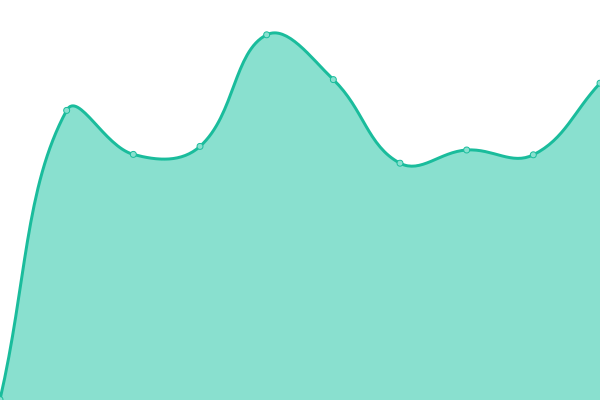
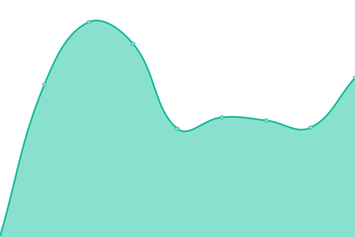
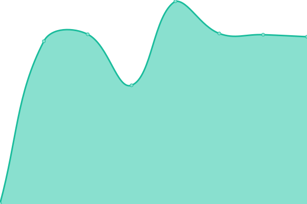
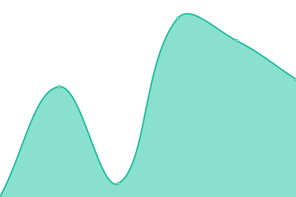

# [📈 Live Status](https://status.ucode.space): <!--live status--> **🟧 Partial outage**

This repository contains the open-source uptime monitor and status page for [Phil](https://ucode.space)

<!--start: status pages-->
<!-- This summary is generated by Upptime (https://github.com/upptime/upptime) -->
<!-- Do not edit this manually, your changes will be overwritten -->
<!-- prettier-ignore -->
| URL | Status | History | Response Time | Uptime |
| --- | ------ | ------- | ------------- | ------ |
|  [Git-Server](https://git.ucode.space) | 🟩 Up | [git-server.yml](https://github.com/sniffingsugar/status/commits/HEAD/history/git-server.yml) | 

 805ms
     
 | 

<a href="https://status.ucode.space/history/git-server">100.00%</a>
    

|  [Docker-Registry](https://registry.ucode.space) | 🟥 Down | [docker-registry.yml](https://github.com/sniffingsugar/status/commits/HEAD/history/docker-registry.yml) | 

 440ms
     
 | 

<a href="https://status.ucode.space/history/docker-registry">0.00%</a>
    

|  [Cloud](https://cloud.ucode.space) | 🟥 Down | [cloud.yml](https://github.com/sniffingsugar/status/commits/HEAD/history/cloud.yml) | 

 0ms
     
 | 

<a href="https://status.ucode.space/history/cloud">0.00%</a>
    

|  [Wakapi](https://time.ucode.space) | 🟥 Down | [wakapi.yml](https://github.com/sniffingsugar/status/commits/HEAD/history/wakapi.yml) | 

 0ms
     
 | 

<a href="https://status.ucode.space/history/wakapi">0.00%</a>
    

|  [Vaultwarden](https://bw.ucode.space) | 🟩 Up | [vaultwarden.yml](https://github.com/sniffingsugar/status/commits/HEAD/history/vaultwarden.yml) | 

 411ms
     
 | 

<a href="https://status.ucode.space/history/vaultwarden">100.00%</a>
    

|  [Encrypt](https://encrypt.ucode.space) | 🟥 Down | [encrypt.yml](https://github.com/sniffingsugar/status/commits/HEAD/history/encrypt.yml) | 

 0ms
     
 | 

<a href="https://status.ucode.space/history/encrypt">0.00%</a>
    

|  [gly.one (URL Shortener)](https://gly.one) | 🟥 Down | [gly-one-url-shortener.yml](https://github.com/sniffingsugar/status/commits/HEAD/history/gly-one-url-shortener.yml) | 

 0ms
     
 | 

<a href="https://status.ucode.space/history/gly-one-url-shortener">0.00%</a>
    

<!--end: status pages-->

[**Visit our status website →**](https://status.ucode.space)

## 📄 License

- Code: [MIT](./LICENSE) © [Phil](https://ucode.space)
- Data in the `./history` directory: [Open Database License](https://opendatacommons.org/licenses/odbl/1-0/)
